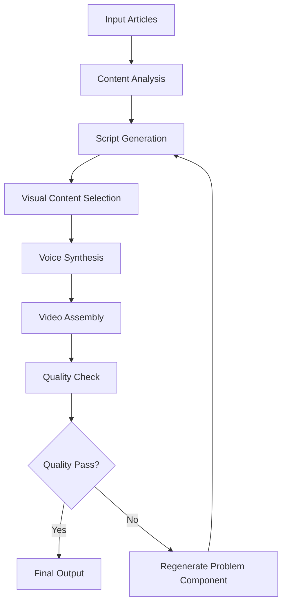

# Video Generation Tool - Specifications & Implementation Guide

## 🎬 **Tool Overview**
An AI-powered system that automatically creates engaging, kid-friendly videos from news articles by combining full original articles with simplified versions to produce short, educational story videos.

---

## 🎯 **Core Functionality**

### **Input Processing**
- **Original Article**: Full news article (complex language, adult-focused)
- **Simplified Version**: Kid-friendly adaptation (2nd-4th grade reading level)
- **Metadata**: Source, date, category, reading level

### **Output Generation**
- **Video Duration**: 90-120 seconds optimal
- **Format**: MP4, 1080p, mobile-optimized
- **Audio**: Clear narration with background music
- **Visuals**: Engaging graphics, animations, and relevant imagery

---

## 🔧 **Technical Architecture**

### **Technology Stack**
```
┌─────────────────┐    ┌──────────────────┐    ┌─────────────────┐
│   Text Input    │────▶│  AI Processing   │────▶│  Video Output   │
│  - Full Article │    │  - Script Gen    │    │  - MP4 Video    │
│  - Kid Version  │    │  - Voice Sync    │    │  - Thumbnails   │
│  - Metadata     │    │  - Visual Match  │    │  - Captions     │
└─────────────────┘    └──────────────────┘    └─────────────────┘
```

### **Core Components**

#### 1. **Script Generation Engine**
- **Purpose**: Create engaging video narrative
- **Technology**: OpenAI GPT-4 or Claude
- **Process**: 
  - Analyze both article versions
  - Extract key story elements
  - Create kid-friendly script with natural flow
  - Add transition phrases and engagement hooks

#### 2. **Visual Content Matcher**
- **Purpose**: Select appropriate imagery and animations
- **Technology**: DALL-E, Midjourney API, or stock image APIs
- **Process**:
  - Extract visual keywords from script
  - Generate/source relevant images
  - Create smooth transitions between visuals
  - Add text overlays and callouts

#### 3. **Voice Synthesis Engine**
- **Purpose**: Create natural-sounding narration
- **Technology**: ElevenLabs, Azure Cognitive Services, or Amazon Polly
- **Process**:
  - Convert script to speech with kid-friendly voice
  - Add emphasis and emotional inflection
  - Sync with visual timeline
  - Include strategic pauses for comprehension

#### 4. **Video Assembly Pipeline**
- **Purpose**: Combine all elements into final video
- **Technology**: FFmpeg, MoviePy, or specialized video APIs
- **Process**:
  - Layer visuals, audio, and text
  - Add background music and sound effects
  - Create smooth transitions
  - Export in multiple formats/resolutions

---

## 📝 **Script Generation Methodology**

### **Content Analysis Process**
```python
def analyze_articles(original_article, kid_version):
    """
    Extract key elements from both versions to create comprehensive script
    """
    analysis = {
        'main_story': extract_core_narrative(original_article),
        'key_facts': identify_important_details(original_article),
        'kid_friendly_angle': get_engagement_hook(kid_version),
        'emotional_tone': determine_appropriate_mood(both_articles),
        'educational_value': identify_learning_opportunities(original_article),
        'complexity_level': assess_concept_difficulty(original_article)
    }
    return analysis
```

### **Script Structure Template**
1. **Hook (10-15 seconds)**
   - Exciting opening question or statement
   - Visual: Attention-grabbing animation
   - Example: "Did you know a robot on Mars just made an amazing discovery?"

2. **Main Story (60-80 seconds)**
   - Core narrative from simplified version
   - Key facts from original article (simplified)
   - Visual: Story-relevant imagery and animations
   - Example: "A super smart robot found crystals that sing when the wind blows!"

3. **Educational Moment (15-20 seconds)**
   - Deeper insight from original article
   - Fun fact or "did you know" element
   - Visual: Educational graphics or comparisons
   - Example: "Mars is called the Red Planet because it's covered in red dust!"

4. **Wrap-up (5-10 seconds)**
   - Encouraging conclusion
   - Call to learn more or discuss
   - Visual: Positive, forward-looking image
   - Example: "What other amazing things do you think we'll discover in space?"

---

## 🎨 **Visual Content Guidelines**

### **Visual Style Requirements**
- **Color Palette**: Bright, cheerful, age-appropriate
- **Animation Style**: Simple, smooth, not overstimulating
- **Text Overlays**: Large, readable fonts (minimum 24pt)
- **Imagery**: Safe, positive, educational

### **Content Sourcing Strategy**
1. **Stock Images**: Curated, child-safe image libraries
2. **AI-Generated**: Custom illustrations for specific topics
3. **Animation Library**: Pre-built educational animations
4. **Icon Sets**: Simple, recognizable symbols and graphics

### **Visual Safety Filters**
- Automated content moderation for inappropriate imagery
- Human review for sensitive topics
- Positive emotion detection (avoid scary/sad visuals)
- Cultural sensitivity checks

---

## 🗣️ **Voice & Audio Specifications**

### **Voice Characteristics**
- **Age**: Young adult (20s-30s sound)
- **Tone**: Friendly, enthusiastic, educational
- **Pace**: Slightly slower than adult pace (140-160 WPM)
- **Emphasis**: Clear pronunciation of new/complex words

### **Audio Quality Standards**
- **Sample Rate**: 44.1 kHz minimum
- **Bit Depth**: 16-bit minimum
- **Noise Floor**: -60dB maximum
- **Dynamic Range**: Compressed for mobile playback

### **Background Audio**
- **Music**: Upbeat, educational, royalty-free
- **Volume**: 20-25% of narration level
- **Sound Effects**: Minimal, purposeful (whoosh, ding, pop)
- **Silence**: Strategic pauses for comprehension

---

## 🔄 **Processing Pipeline**

### **Step-by-Step Workflow**



### **Processing Time Estimates**
- **Script Generation**: 30-60 seconds
- **Visual Selection/Generation**: 2-3 minutes
- **Voice Synthesis**: 1-2 minutes
- **Video Assembly**: 3-5 minutes
- **Quality Check**: 30 seconds
- **Total**: 7-11 minutes per video

---

## 📊 **Quality Assurance**

### **Automated Checks**
1. **Content Safety**: Scan for inappropriate content
2. **Audio Quality**: Check volume levels and clarity
3. **Visual Coherence**: Ensure images match script
4. **Duration**: Verify 90-120 second target
5. **Reading Level**: Confirm age-appropriateness

### **Human Review Triggers**
- Sensitive topics (disasters, conflicts, etc.)
- New vocabulary words above grade level
- Complex scientific concepts
- Cultural or religious content
- Any automated flag from safety systems

### **Quality Metrics**
- **Comprehension Score**: Based on script complexity
- **Engagement Score**: Visual and audio appeal rating
- **Safety Score**: Content appropriateness for children
- **Educational Value**: Learning opportunity assessment

---

## 🚀 **Implementation Plan**

### **Phase 1: Core Engine (4-6 weeks)**
- Basic script generation from article inputs
- Simple voice synthesis integration
- Static image selection and overlay
- Basic video assembly pipeline

### **Phase 2: Enhancement (3-4 weeks)**
- Advanced visual matching algorithms
- Dynamic animation integration
- Background music and sound effects
- Quality assurance automation

### **Phase 3: Optimization (2-3 weeks)**
- Processing time optimization
- Batch processing capabilities
- Error handling and retry logic
- Monitoring and analytics

### **Phase 4: Integration (1-2 weeks)**
- App/newsletter system integration
- API development and documentation
- Testing with real newsletter content
- Production deployment

---

## 💻 **Technical Implementation**

### **Recommended Technology Stack**
```python
# Core Dependencies
- openai>=1.0.0              # GPT-4 for script generation
- elevenlabs>=0.2.0          # Voice synthesis
- moviepy>=1.0.3             # Video assembly
- requests>=2.28.0           # API communications
- pillow>=9.0.0              # Image processing
- pydub>=0.25.0              # Audio processing

# Optional Enhancements
- stability-ai-sdk           # Image generation
- azure-cognitiveservices    # Alternative voice options
- opencv-python              # Advanced video processing
- whisper-openai             # Audio transcription for QA
```

### **API Integration Points**
1. **Newsletter System**: Receive article content
2. **Voice Service**: Generate narration audio
3. **Image Service**: Source/generate visuals
4. **Video Storage**: Upload completed videos
5. **Quality Service**: Automated content review

### **Configuration Management**
```yaml
# config.yaml
video_generation:
  target_duration: 120  # seconds
  max_duration: 150
  min_duration: 90
  
  voice:
    speed: 0.9
    stability: 0.8
    similarity_boost: 0.8
    
  visuals:
    resolution: "1080p"
    framerate: 30
    transition_duration: 0.5
    
  audio:
    music_volume: 0.25
    narration_volume: 1.0
    effects_volume: 0.15
```

---

## 📈 **Performance Optimization**

### **Processing Optimizations**
1. **Parallel Processing**: Run voice and visual generation simultaneously
2. **Template Caching**: Reuse visual templates for similar stories
3. **Content CDN**: Cache generated assets for reuse
4. **Batch Processing**: Handle multiple articles efficiently

### **Cost Optimization**
- **AI API Usage**: Optimize prompts for token efficiency
- **Storage Strategy**: Compress videos without quality loss
- **Caching Strategy**: Reduce redundant API calls
- **Resource Scheduling**: Use off-peak pricing when possible

---

## 🔍 **Monitoring & Analytics**

### **Key Metrics to Track**
- **Processing Success Rate**: Percentage of successful video generations
- **Average Processing Time**: Time from input to output
- **Quality Scores**: Automated and human review ratings
- **User Engagement**: Video completion rates in app
- **Error Patterns**: Common failure points for improvement

### **Alerting System**
- Processing failures > 5% in 1 hour
- Average processing time > 15 minutes
- Quality scores < 80% for any video
- Storage capacity < 20% remaining
- API rate limits approaching

---

## 💰 **Cost Estimation**

### **Per Video Costs** (Estimated)
- **GPT-4 API**: $0.15-0.30 per script
- **Voice Synthesis**: $0.20-0.40 per narration
- **Image Generation**: $0.10-0.25 per set
- **Processing Compute**: $0.05-0.10 per video
- **Storage & CDN**: $0.02-0.05 per video
- **Total**: $0.52-1.10 per video

### **Monthly Costs** (16-20 videos)
- **Direct Costs**: $8.32-22.00
- **Infrastructure**: $50-100
- **Monitoring**: $20-40
- **Total**: $78.32-162.00

---

## 🎯 **Success Criteria**

### **Technical Metrics**
- 95%+ successful video generation rate
- < 10 minute average processing time
- 90%+ automated quality approval rate
- 99.5% uptime for video generation service

### **Quality Metrics**
- 4.5+ average quality score (out of 5)
- 85%+ child comprehension rate (testing)
- 90%+ parent approval rate
- < 1% content safety flags

### **Business Metrics**
- 80%+ video completion rate in app
- 25%+ increase in newsletter engagement
- 15%+ improvement in subscription retention
- Cost per video < $1.00

---

*This tool will significantly enhance the educational value and engagement of the newsletter by providing rich, multimedia content that appeals to visual learners and maintains children's attention.*
